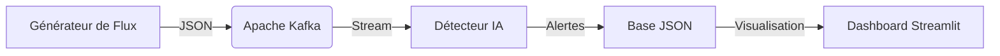

# 🛡️ MoneyShield CI
### Plateforme Intelligente de Protection Anti-Fraude Mobile Money (Côte d'Ivoire)

**MoneyShield CI** est une solution de pointe utilisant l'Intelligence Artificielle pour détecter et prévenir la fraude sur les réseaux Mobile Money en temps réel. Adaptée spécifiquement au contexte ivoirien, elle surveille les flux de transactions et identifie les comportements suspects tels que le broutage, le SIM swap et l'ingénierie sociale.

---

## 🚀 Fonctionnalités Clés

- **Détection IA Temps Réel** : Modèle *Isolation Forest* entraîné sur plus de 20 000 transactions types.
- **Classification des Fraudes** : Identification automatique des motifs (Broutage, Blanchiment, SIM Swap, etc.).
- **Dashboard Premium** : Interface Streamlit moderne avec cartographie des menaces et KPIs financiers.
- **Architecture Scalable** : Pipeline de données basé sur **Apache Kafka** pour une analyse à flux continu.
- **Contexte Local** : Support complet des opérateurs (Orange, MTN, Moov, Wave) et des 20 plus grandes communes/villes de CI.

---

## 🏗️ Architecture Technique



---

## 🔧 Installation & Configuration

### Prérequis
- Python 3.10+
- Docker & Docker-Compose (pour Kafka)
- Environnement virtuel (recommandé)

### Configuration rapide
1. **Initialiser l'environnement** :
   ```bash
   python -m venv .venv
   .\.venv\Scripts\activate
   pip install -r requirements.txt
   ```

2. **Démarrer les services infrastructure** :
   ```bash
   docker-compose up -d
   ```

3. **Entraîner le modèle** (si nécessaire) :
   ```bash
   .\.venv\Scripts\python.exe app/detector/entrainement.py
   ```

---

## 🎮 Utilisation

Pour simplifier l'usage, des scripts automatisés sont disponibles à la racine :

- **`start_app.bat`** : Lance l'ensemble de la suite (Générateur, Détecteur, Dashboard).
- **`stop_app.bat`** : Arrête proprement tous les services et conteneurs.

### Simulation de Scénarios
Le générateur simule 10 types de fraudes avancées :
- **Broutage** : Transactions nocturnes massives.
- **SIM Swap** : Prise de contrôle de compte via USSD/Agent.
- **Blanchiment** : Flux financiers atypiques en zones rurales (ex: Soubré).
- **Ingénierie Sociale** : Arnaques par SMS/Appels.

---

## 📁 Structure du Projet

- `app/dashboard/` : Application Streamlit et base de données des alertes.
- `app/detector/` : Modèle IA et logique de détection en temps réel.
- `app/generator/` : Simulateur de transactions ivoiriennes réalistes.
- `docker-compose.yml` : Configuration Kafka/Zookeeper.

---

## 🛡️ À propos
Développé pour sécuriser l'écosystème numérique en Côte d'Ivoire. 
**Sécurité. Transparence. Rapidité.**
