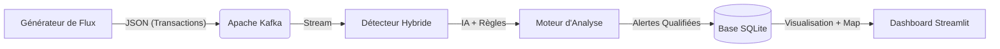

# 🛡️ MoneyShield CI
### Intelligence Artificielle de Lutte Anti-Fraude Mobile Money (Côte d'Ivoire)


**MoneyShield CI** est une plateforme de sécurité avancée conçue pour protéger l'écosystème Mobile Money en Côte d'Ivoire. Elle combine **l'Intelligence Artificielle (Isolation Forest)** et un **moteur de règles expertes** pour détecter, classifier et bloquer les transactions frauduleuses en temps réel.

---

## 🎯 Problématique & Solution

Le marché ivoirien du Mobile Money fait face à des menaces spécifiques et évolutives : "Broutage", Arnaques aux faux frais, SIM Swap, et Blanchiment d'argent dans les zones rurales.

**MoneyShield CI répond par une approche hybride :**
1.  **Détection d'Anomalies (IA)** : Repère les comportements atypiques inconnus.
2.  **Classification Expert (Règles)** : Identifie précisément le *type* de fraude selon le contexte local (Villes, Opérateurs, Comportement).

---

## 🚀 Fonctionnalités Clés

-   **⏱️ Détection Temps Réel** : Analyse instantanée des flux de transactions via Apache Kafka.
-   **🧠 Classification Hybride** :
    -   *IA* : Score d'anomalie (-1 à 1).
    -   *Règles* : Score de confiance (0% à 100%) pour catégoriser la menace.
-   **📊 Dashboard & Finance** :
    -   *Sécurité* : Visualisation des alertes et **Cartographie Interactive** (Zones sensibles).
    -   *Finance* : Suivi des volumes financiers, panier moyen et **prévisions IA**.
-   **🇨🇮 Contexte Local** : Support des opérateurs (Orange, MTN, Moov, Wave) et géolocalisation ivoirienne (Abidjan, Bouaké, Soubré, etc.).
-   **🛡️ Gestion Complète** : Scripts d'automatisation pour le démarrage, l'arrêt, et la maintenance de la base de données.

---

## 🏗️ Architecture Technique



---

## 🔧 Installation

### Prérequis
-   **Docker Desktop** (pour Kafka/Zookeeper)
-   **Python 3.10+**

### Configuration
1.  **Cloner le projet**
2.  **Créer l'environnement virtuel** :
    ```bash
    python -m venv .venv
    .\.venv\Scripts\activate
    ```
6.  **Installer les dépendances** :
    ```bash
    pip install -r requirements.txt
    ```

### 🔒 Configuration Globale (.env)
A la racine du projet, créez un fichier `.env` pour sécuriser vos accès :
```ini
ADMIN_USER=admin
ADMIN_PASSWORD=MonMotDePasseSecret
KAFKA_BOOTSTRAP_SERVERS=localhost:9092
```

---

## 🎮 Utilisation Simplifiée

Le projet inclut une suite de scripts `.bat` à la racine pour faciliter l'orchestration.

### 🟢 Démarrer l'Application
Lancez **`start_app.bat`**. Ce script va automatiquement :
1.  Démarrer les conteneurs Docker (Kafka).
2.  Lancer le Générateur de transactions.
3.  Lancer le Détecteur de fraudes.
4.  Ouvrir le Dashboard dans votre navigateur.

### 🔴 Arrêter l'Application
Lancez **`stop_app.bat`**.
*   Arrête proprement tous les processus Python.
*   Stoppe les conteneurs Docker.

### 🛠️ Outils de Maintenance
-   **`clean_db.bat`** : ⚠️ Vide la base de données des alertes (utile pour repartir à zéro avant une démo).
-   **`view_database.bat`** : Affiche le contenu brut de la base de données dans le terminal.
-   **`run_tests.bat`** : Exécute la suite de tests unitaires (notamment pour le classificateur).
-   **`diagnostic.bat`** : Vérifie l'état du système (Docker, Python, Kafka).

---

## 🕵️‍♂️ Types de Fraudes Détectées

Le système identifie 7 types de menaces majeures (détails dans [`CLASSIFICATION_FRAUDE.md`](CLASSIFICATION_FRAUDE.md)) :

| Type | Priorité | Description |
| :--- | :--- | :--- |
| **SIM Swap** | 🔴 Haute | Prise de contrôle du compte via changement de SIM. |
| **Blanchiment** | 🔴 Haute | Flux massifs atypiques, souvent en zones rurales. |
| **Broutage** | 🟠 Moyenne | Cybercriminalité nocturne, extorsion. |
| **Schtroumpfage** | 🟠 Moyenne | Accumulation de petits montants pour éviter les seuils. |
| **Vélocité** | 🟠 Moyenne | Répétition anormale de transactions rapides. |
| **Ingénierie Sociale** | 🟡 Faible | Arnaques par manipulation (Phishing/Vishing). |
| **Vol Physique** | 🟡 Faible | Retraits rapides après vol de téléphone. |

---

## 🎭 Scénarios de Démo

Exemples de scénarios simulés par le générateur (détails dans [`scenario.md`](scenario.md)) :

> **Le "Brouteur" de Yopougon**
> *   **Contexte** : 3h du matin, Yopougon.
> *   **Action** : Transfert de 500k vers Wave via App.
> *   **Détection** : `Broutage` (Score confiance : 92%).

> **Le "Gbaka" de Blanchiment**
> *   **Contexte** : Soubré, compte dormant.
> *   **Action** : Dépôt massif de 5M FCFA suivi d'un retrait immédiat.
> *   **Détection** : `Blanchiment` (Score confiance : 80%).

---

## 📁 Structure du Projet

```
mobile-money-ai/
├── app/
│   ├── dashboard/      # Interface Streamlit (app.py)
│   ├── detector/       # Moteur IA & Règles (detecteur.py, classificateur_fraude.py)
│   └── generator/      # Simulation (generate_transactions.py)
├── *.bat               # Scripts d'automatisation (start, stop, clean, etc.)
├── CLASSIFICATION_FRAUDE.md # Documentation détaillée des règles
├── scenario.md         # Description des scénarios de test
├── moneyshield.db      # Base de données SQLite
└── docker-compose.yml  # Infrastructure Kafka
```

---

